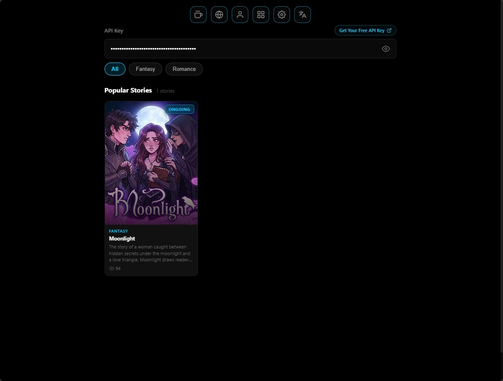
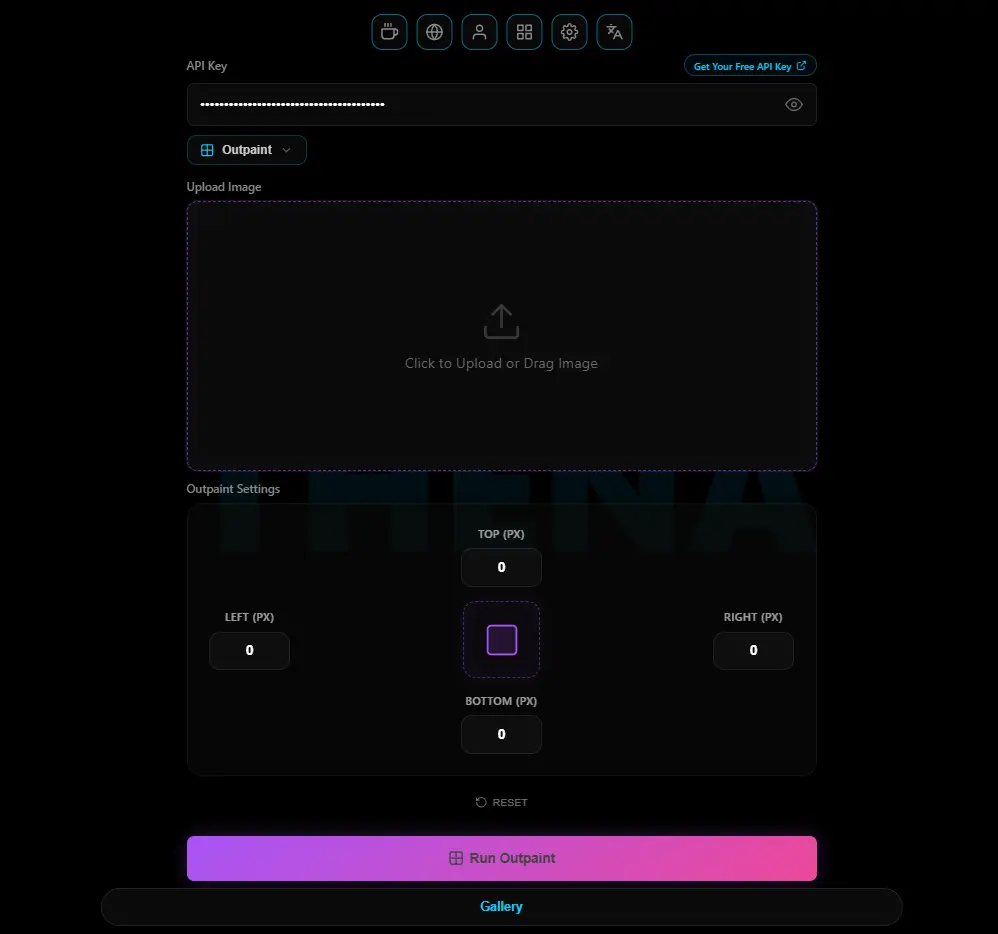

<div align="center">
  <b>🌍 <a href="README.md">English</a> &nbsp; | &nbsp; 🇹🇷 <a href="README.tr.md">Türkçe</a></b>
</div>

<br/>

<div align="center">

  <a href="https://phaticusthiccy.github.io/Thena-Web/">
    
  </a>

  <h1>THENA</h1>
  <h3>Next-Generation AI Image Generator, Roleplay Chat, Image Editor & Visual Stories</h3>

  <p>
    <a href="https://github.com/phaticusthiccy/Thena-Web/issues">
      
    </a>
    <a href="https://github.com/phaticusthiccy/Thena-Web/stargazers">
      
    </a>
    <a href="https://github.com/phaticusthiccy/Thena-Web/blob/main/LICENSE">
      
    </a>
    
    
  </p>

  <blockquote>
    <em>Transform your imagination into stunning visuals in seconds — no installation, no backend, entirely in your browser.</em>
  </blockquote>

  <a href="https://phaticusthiccy.github.io/Thena-Web/">
    
  </a>

  <br /><br />

</div>

---

## 🗂️ Table of Contents

- [About The Project](#-about-the-project)
- [Key Features](#-key-features)
- [Screenshots](#-screenshots)
- [Installation & Usage](#%EF%B8%8F-installation--usage)
- [Configuration (API Key)](#-configuration-api-key)
- [Tech Stack](#-tech-stack)
- [Contributing](#-contributing)
- [License](#-license)

---

## 🚀 About The Project

**Thena** is a browser-native, high-performance AI creative platform engineered entirely with **Vanilla JavaScript, HTML5, and CSS3** — no React, no Vue, no heavy frameworks. It harnesses the full power of modern browser APIs (IndexedDB, Web Audio API, Canvas API, Service Workers) to deliver a desktop-grade experience straight from the tab.

It unifies four powerful pillars into one seamless **Progressive Web App (PWA)**:

| Pillar | Description |
|---|---|
| 🎨 **AI Image Generation** | Multi-model, multi-style image synthesis with live prompt feedback |
| 🤖 **AI Roleplay Chat** | Deep narrative conversations with emotion-aware AI characters |
| 🖼️ **Image Editor** | Professional-grade canvas tools, AI outpainting, filters & markup |
| 📖 **AI Stories (Thena Toons)** | Immersive visual webtoon reader with dynamic chapter navigation |

---

## ✨ Key Features

### 🎨 Advanced Image Generation
- **Multi-Model Support** — Choose from Photorealism, Anime, Cinematic, Thena Toonish (cel-shaded modern anime), and other creative models with unique visual styles.
- **Flexible Aspect Ratios** — Square (1:1), Portrait (3:4, 9:16), and Widescreen (16:9, 4:3) formats supported out of the box.
- **Smart Generation Parameters** — Fast Mode for speed, Creative & Dense for depth, and HighRes scaling for crisp output.
- **Expanded Presets & Styles** — Instantly apply community-crafted prompts and curated aesthetic styles with a single click.
- **Live Prompt Preview** — Dynamic visual indicator shows required prompt length and complexity before generation starts.
- **Magic Wand ✨** — Transforms short, vague prompts into rich, detailed descriptions automatically.

### 🤖 AI Roleplay Chat
- **Immersive Characters** — Engage in deep, story-driven conversations with AI personas (including dating simulation characters) featuring fully fleshed-out lore and backstories.
- **Three Intelligence Tiers** — Switch between Fast, Balanced, and Ultra (Advanced) AI models to match your narrative needs.
- **Real-Time Emotion Engine** — Live sentiment analysis dynamically updates the character's facial expression to reflect the story's emotional tone.
- **Personalized User Profiles** — Create your own profile (Name, Age, Gender). The system uses advanced context metadata extraction to ensure characters adapt their tone, memory, and responses specifically to you.
- **Flexible Library Layouts** — Organize your character roster in Grid, List, or Compact view — switch effortlessly.
- **Narrative Awareness** — The AI detects story completion via the `[FINISH]` signal and guides arcs to natural conclusions.
- **The Warden — Content Moderation** — Integrated moderation layer with real-time intensity indicators (Low / Medium / High).

### 🖼️ Professional Image Editor
- **AI Outpainting** — Seamlessly expand the borders of your generated images using intelligent AI outpainting, adding new areas contextually.
- **Advanced Model Selection** — Choose the right AI model for your edits using dynamic "FAST" (PixelFusion), "BEST" (NeuralFlow), and "MAX" (Synapse) badges, complete with pros/cons insights.
- **Instant Filter Presets** — Apply Instagram-inspired filters with a real-time localized search bar to find the perfect look.
- **Manual Fine-Tuning** — Full control over brightness, contrast, saturation, temperature, and more.
- **Crop & Resize** — Prepare your generated art for any platform or resolution — all within the browser.
- **Markup Tools** — Draw, annotate, and overlay text on generated images for creative or instructional use.

### 📖 AI Stories (Thena Toons)
- **Immersive Webtoon Reader** — Dive into curated, multi-chapter visual stories with a dedicated, distraction-free reading interface.
- **Dynamic Episode Navigation** — Seamlessly navigate between chapters with an intuitive UI, complete with "Ongoing" and "Completed" status tracking.
- **Optimized Performance** — Lazy-loaded high-resolution image sequences ensure fast load times and minimal memory usage.
- **Whimsical UI Animations** — Enjoy polished, custom animations and multi-language status messages upon finishing a chapter.

### 📊 Performance & Optimization
- **Real-Time System Stats** — Monitor CPU load, RAM usage, FPS, and average render times via a live performance HUD.
- **Smart Power Saver** — Automatically pauses background tasks, mutes audio, and activates Wake Lock API when the app is idle.
- **Intelligent Rendering Engine** — `IntersectionObserver`-driven animation pausing for off-screen elements drastically reduces GPU/CPU load.
- **Optimized Chat Rendering** — DOM-efficient message pipeline ensures smooth, lag-free scrolling even across thousands of messages.
- **Draggable HUD** — Reposition and resize the performance monitor anywhere on screen without interrupting animations.

### 🌐 Localization & Accessibility
- **Full Multi-Language Support** — Complete UI translation in **English** and **Turkish**, including dynamic search logic, gallery labels, and all system notifications.
- **Audio Feedback System** — Contextual sound effects for interactions, with a dedicated Silent Mode toggle.
- **Cinematic Intro Experience** — An immersive trailer plays on first launch; skip anytime to jump straight to the app.
- **Polished Mobile Experience** — Fully responsive layout with drag-to-dismiss bottom sheets and mobile-optimized chat sidebars.

### 💾 Local-First Architecture
- **Advanced Gallery Management** — Filter, sort (Newest / Oldest), and mass-delete images via Long-Press Multi-Select mode.
- **Drag-to-Dismiss Gesture** — Intuitively close full-screen image views with a fluid swipe gesture.
- **Zero-Backend Privacy** — All media, conversations, and custom profiles live exclusively in your browser's local storage via IndexedDB.
- **Your Data Stays Yours** — API keys and generated content never leave your device. No hidden uploads, ever.

---

## 📸 Screenshots

<div align="center">
  <table>
    <tr>
      <td align="center"><b>Main Interface</b></td>
      <td align="center"><b>Advanced Image Editor</b></td>
    </tr>
    <tr>
      <td><a href="src/image_gen.webp"></a></td>
      <td><a href="src/image_edit.webp"></a></td>
    </tr>
  </table>
  <table>
    <tr>
      <td align="center"><b>AI Roleplay Chat</b></td>
      <td align="center"><b>AI Stories (Webtoon Reader)</b></td>
    </tr>
    <tr>
      <td><a href="src/chatbot.webp"></a></td>
      <td><a href="src/thena_comic_page.webp"></a></td>
    </tr>
  </table>
  <table>
    <tr>
      <td align="center"><b>Gallery & Filters</b></td>
      <td align="center"><b>AI Outpainting</b></td>
    </tr>
    <tr>
      <td><a href="src/gallery.webp"></a></td>
      <td><a href="src/outpaint_editor.webp"></a></td>
    </tr>
  </table>

  <br />

  <details>
    <summary><b>Show More Screenshots</b></summary>
    <br />
    <table>
      <tr>
        <td align="center"><b>Cinematic Intro</b></td>
        <td align="center"><b>Model Showcase</b></td>
      </tr>
      <tr>
        <td><a href="src/trailer.webp"></a></td>
        <td><a href="src/showcase.webp"></a></td>
      </tr>
    </table>
    <table>
      <tr>
        <td align="center"><b>Chat — Opening Scene</b></td>
        <td align="center"><b>Chat — Story Conclusion</b></td>
      </tr>
      <tr>
        <td><a href="src/chat_start.webp"></a></td>
        <td><a href="src/chat_end.webp"></a></td>
      </tr>
    </table>
    <table>
      <tr>
        <td align="center"><b>Advanced Settings</b></td>
        <td align="center"><b>App Switcher</b></td>
      </tr>
      <tr>
        <td><a href="src/adv_settings_image_gen.webp"></a></td>
        <td><a href="src/apps.webp"></a></td>
      </tr>
    </table>
    <table>
      <tr>
        <td align="center"><b>Prompt Preview Module</b></td>
        <td align="center"><b>Settings Panel</b></td>
      </tr>
      <tr>
        <td><a href="src/prompt_preview.webp"></a></td>
        <td><a href="src/settings.webp"></a></td>
      </tr>
    </table>
    <table>
      <tr>
        <td align="center"><b>Gallery Statistics</b></td>
        <td align="center"><b>AI Model Browser</b></td>
      </tr>
      <tr>
        <td><a href="src/gallery_stats.webp"></a></td>
        <td><a href="src/model_showcase.webp"></a></td>
      </tr>
    </table>
  </details>
</div>

---

## 🛠️ Installation & Usage

Thena is entirely client-side. **No server setup or installation is required.**

### Option 1 — Direct Open
```bash
git clone https://github.com/phaticusthiccy/Thena-Web.git
```
Then simply double-click `index.html` to open it in your browser.

### Option 2 — Local Dev Server *(Recommended)*
Running a local server avoids CORS restrictions and enables full PWA features (audio, offline mode, install prompt).

| Method | Command |
|---|---|
| **VS Code** | Install the *Live Server* extension → click **"Go Live"** |
| **Python** | `python -m http.server 8000` |
| **Node.js** | `npx http-server .` |

---

## 🔑 Configuration (API Key)

An API key is required to use the image generation features. Getting one is free and takes under a minute.

1. Click the **"Get Your Free API Key"** link inside the app (redirects to the official Telegram Bot).
2. Paste the key you receive into the `API Key` field in the Settings panel.
3. Your key is stored securely in your browser's `LocalStorage` — it never leaves your device.

---

## 🧩 Tech Stack

| Technology | Role |
|---|---|
| **HTML5** | Semantic structure, accessibility, and DOM layout |
| **CSS3** | Animations, Flexbox/Grid, Glassmorphism, and responsive design |
| **JavaScript (ES6+)** | Core application logic, API communication, and DOM management |
| **IndexedDB** | Persistent local storage for the image gallery and chat history |
| **Web Audio API** | Real-time audio synthesis and UI sound effects |
| **Canvas API** | Image processing, resizing, filtering, and editing |
| **Service Workers** | PWA offline capabilities and installability |

---

## 🤝 Contributing

Contributions are welcome and greatly appreciated. To get started:

1. **Fork** the repository.
2. **Create** a feature branch: `git checkout -b feature/your-feature-name`
3. **Commit** your changes: `git commit -m 'feat: add your feature description'`
4. **Push** to your branch: `git push origin feature/your-feature-name`
5. **Open** a Pull Request and describe what you've changed.

Please follow conventional commit style and keep PRs focused on a single concern.

---

## 📝 License

This project is distributed under the [MIT](LICENSE) License. See `LICENSE` for more information.

<div align="center">
<br />
<p>Developed with passion by <a href="https://t.me/phaticusthiccy"><b>@phaticusthiccy</b></a></p>
<p><i>Made with ❤️ and lots of ☕</i></p>
<br />
<a href="https://phaticusthiccy.github.io/Thena-Web/">
  
</a>
</div>