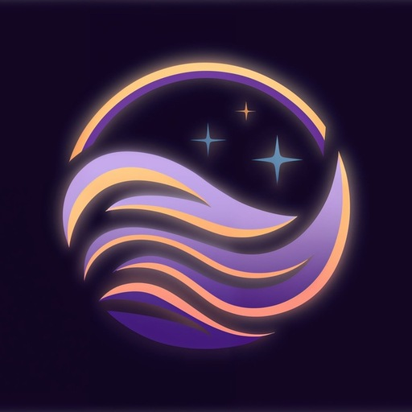

<div align="center">
  <b>🌍 <a href="README.md">English</a> &nbsp; | &nbsp; 🇹🇷 <a href="README.tr.md">Türkçe</a></b>
</div>

<br/>

<div align="center">

  <a href="https://phaticusthiccy.github.io/Thena-Web/">
    
  </a>

  # THENA - Yeni Nesil Yapay Zeka Görüntü Oluşturucu & Sohbet
  
  **Nihai Yaratıcılık Paketi • Gelişmiş Rol Yapma Sohbeti • Görüntü Düzenleme • Önce Yerel (Local First)**

  <p>
    <a href="https://github.com/phaticusthiccy/Thena-Web/issues">
      
    </a>
    <a href="https://github.com/phaticusthiccy/Thena-Web/stargazers">
      
    </a>
    <a href="https://github.com/phaticusthiccy/Thena-Web/blob/main/LICENSE">
      
    </a>
    
  </p>

  <p>
    <i>Hayal gücünüzü saniyeler içinde gerçeğe dönüştürün. Kurulum yok, backend yok, tamamen tarayıcınızın içinde (client-side).</i>
  </p>
  
  <a href="https://phaticusthiccy.github.io/Thena-Web/">
    
  </a>
  
  <br />
</div>

---

## 🚀 Proje Hakkında

**Thena**, tamamen **Vanilla JavaScript, HTML ve CSS** kullanılarak oluşturulmuş, tarayıcı tabanlı, modern ve estetik bir Yapay Zeka platformudur. React veya Vue gibi ağır framework'lere ihtiyaç duymadan tarayıcı teknolojilerinin (IndexedDB, Web Audio API, Canvas API) sınırlarını zorlar.

Son teknoloji **Görüntü Oluşturma (Image Generation)** motorunu, interaktif **Yapay Zeka Rol Yapma Sohbetini (AI Roleplay Chat)** ve profesyonel bir **Görüntü Düzenleyiciyi (Image Editor)** tek bir kusursuz İlerici Web Uygulamasında (PWA) birleştirir.

---

## ✨ Temel Özellikler

### 🎨 Gelişmiş Görüntü Oluşturma
* **Çoklu Model Desteği:** Fotorealizm, Anime, Sinematik ve diğer yaratıcı seçeneklerin de dahil olduğu çeşitli modellere erişim.
* **Esnek En Boy Oranları:** Kare (1:1), Dikey (3:4, 9:16) ve Sinema (16:9, 4:3) formatları desteği.
* **Akıllı Parametreler:** Hız için Hızlı Mod (Fast Mode), derin ayrıntılar için Yaratıcı ve Yoğun (Creative & Dense) modlar ve Yüksek Çözünürlüklü (HighRes) ölçekleme içerir.
* **Genişletilmiş Şablonlar (Presets) & Stiller:** Topluluktan ilham alan komutları ve estetik stilleri anında uygulayın.
* **Canlı Komut Önizlemesi:** Üretimden önce gereken komut uzunluğunu gösteren dinamik görsel geri bildirim.
* **Sihirli Değnek (Magic Wand):** Kısa ve basit komutları tek bir tıklamayla detaylı açıklamalara dönüştürür.

### 🤖 Yapay Zeka Rol Yapma Sohbeti
* **Etkileşimli Karakterler:** Zengin irfan (lore) ve arka plan hikayeleri sunan yapay zeka karakterleriyle hikaye odaklı sohbetlere dalın.
* **Dinamik Sistem Komutları:** Kendi kullanıcı profilinizi oluşturun (İsim, Yaş, Cinsiyet). Karakterler, tonlarını ve hafızalarını size özel olarak uyarlayacaktır.
* **Özelleştirilebilir Görünümler:** Karakter kütüphanenizi düzenlemek için Izgara (Grid), Liste (List) ve Kompakt görünümler arasında zahmetsizce geçiş yapın.
* **Hikaye Farkındalığı:** Yapay zeka, bir anlatı örgüsünün tamamlandığını tespit eder (`[FINISH]` sinyali aracılığıyla) ve hikayeyi yönlendirebilir.
* **The Warden & Moderasyon Arayüzü:** Gerçek zamanlı tetikleyici seviye göstergeleriyle (Düşük, Orta, Yüksek) entegre içerik denetimi.

### 🖼️ Profesyonel Görüntü Düzenleyici
* **Hızlı Şablonlar (Presets):** Gerçek zamanlı Türkçe/İngilizce filtre arama çubuğu içeren, Instagram benzeri filtreleri anında uygulayın.
* **İnce Ayarlar:** Parlaklık, kontrast, doygunluk, sıcaklık vb. ışık değerlerini manuel olarak ayarlayın.
* **Kırpma ve Boyutlandırma:** Ürettiğiniz görselleri doğrudan tarayıcı içerisinde kırpın.
* **Çalışma Alanı Tercihleri:** Düzenleyici panellerinin görünümlerini değiştirin ve çalışma alanı düzenini zahmetsizce kaydedin.
* **İşaretleme Araçları (Markup):** Oluşturulan görselleri çizin, notlar ekleyin veya metin yazın.

### 📊 Performans İzleme
* **Gerçek Zamanlı İstatistikler:** RAM kullanımını doğru bir şekilde izleyin, FPS düşüşlerini gözlemleyin ve ortalama işleme (render) sürelerini görün.
* **Özelleştirilebilir Eklenti Penceresi:** Arayüz animasyonlarını engellemeden performans izleme kutusunu sürükleyip bırakarak yeniden konumlandırın.

### 🌐 Yerelleştirme ve Erişilebilirlik
* **Çoklu Dil Desteği:** Dinamik arama mantığı ve galeri yönetimi de dahil olmak üzere tam çevrilmiş arayüz **İngilizce** ve **Türkçe** dillerinde mevcuttur.
* **Sesli Geri Bildirim:** Tıklama ve işlemler için dinamik arabirim ses efektleri (Sessiz Mod desteği ile).
* **Mobil Deneyim:** Sürükle-kapat (drag-to-dismiss) sayfalar ve sohbet yan çubuklarıyla (chat-sidebar) optimize edilmiş arayüz tasarımları.

### 💾 Önce Yerel (Local-First) Mimari
* **Gelişmiş Galeri Yönetimi:** Görselleri filtreleyin, sıralayın (En Yeni/En Eski) ve Çoklu Seçim (Multi-Select) özelliğiyle toplu işlem uygulayın.
* **Akıcı Hareketler:** Tam ekran resim görünümlerini Sürükle-Kapat ("Drag-to-Dismiss") kaydırma hareketiyle kapatın.
* **IndexedDB ile Tam Gizlilik:** Tüm medyanız, sohbetleriniz ve özel profilleriniz tamamen tarayıcınızın yerel depolamasında yaşar.
* **Veri Gizliliği:** API anahtarınız uygulamanızda çalışır, harici bir sunucuya gitmez.

---

## 📸 Ekran Görüntüleri

<div align="center">
  <table>
    <tr>
      <td align="center"><b>Ana Arayüz</b></td>
      <td align="center"><b>Gelişmiş Görüntü Düzenleyici</b></td>
    </tr>
    <tr>
      <td></td>
      <td></td>
    </tr>
  </table>
  <table>
    <tr>
      <td align="center"><b>Yapay Zeka Sohbet Botları</b></td>
      <td align="center"><b>Galeri ve Filtreler</b></td>
    </tr>
    <tr>
      <td></td>
      <td></td>
    </tr>
  </table>

  <br />

  <details>
    <summary><b>Daha Fazla Ekran Görüntüsü Göster</b></summary>
    <br />
    <table>
      <tr>
        <td align="center"><b>Gelişmiş Ayarlar</b></td>
        <td align="center"><b>Uygulama Seçici</b></td>
      </tr>
      <tr>
        <td></td>
        <td></td>
      </tr>
    </table>
    <table>
      <tr>
        <td align="center"><b>Komut Önizleme Modülü</b></td>
        <td align="center"><b>Ayarlar Menüsü</b></td>
      </tr>
      <tr>
        <td></td>
        <td></td>
      </tr>
    </table>
  </details>
</div>

---

## 🛠️ Kurulum ve Kullanım

Bu proje tamamen tarayıcı içinde (client-side) çalışır. Herhangi bir backend kurulumu gerektirmez.

### Yöntem 1: Doğrudan Başlatma
1. Projeyi bilgisayarınıza indirin veya klonlayın:
    ```bash
    git clone https://github.com/phaticusthiccy/Thena-Web.git
    ```
2. Tarayıcınızda açmak için `index.html` dosyasına çift tıklamanız yeterlidir.

### Yöntem 2: Yerel Sunucu (Önerilen)
PWA (Progressive Web App) kurulumu, ses algılamaları ve cihaz galerisine doğrudan erişim gibi durumlarda CORS sorunlarını önlemek için projeyi yerel bir sunucuda (localhost) çalıştırmanız önerilir.

* **VS Code:** "Live Server" eklentisini kullanın ve ekranın sağ altındaki "Go Live" düğmesine tıklayın.
* **Python:**
    ```bash
    python -m http.server 8000
    ```
* **Node.js (http-server):**
    ```bash
    npx http-server .
    ```

---

## 🔑 Yapılandırma (API Anahtarı / API Key)

Görüntü oluşturmak için ücretsiz bir API Anahtarına ihtiyacınız var.

1.  Uygulama arayüzündeki **"Get Your Free API Key" (Ücretsiz API Anahtarı Al)** bağlantısına tıklayın (sizi Telegram Botuna yönlendirecektir).
2.  Bot tarafından sağlanan anahtarı uygulamadaki `API Key` giriş alanına (Ayarlar sekmesi) yapıştırın.
3.  Anahtarınız tarayıcınızın `LocalStorage` alanında güvenli şekilde saklanacaktır.

---

## 🧩 Teknoloji Yığını

| Teknoloji | Kullanım Alanı |
| --- | --- |
| **HTML5** | Semantik yapı ve DOM düzeni |
| **CSS3** | Animasyonlar, Flexbox/Grid, Glassmorphism, Duyarlı (Responsive) Tasarım |
| **JavaScript (ES6+)** | Temel mantık, API iletişimi, DOM manipülasyonu |
| **IndexedDB** | Görüntü galerisi vb. içerikler için kalıcı yerel depolama |
| **Web Audio API** | Arayüz (UI) sesleri için gerçek zamanlı oynatma sistemi |
| **Canvas API** | Görüntü işleme, boyutlandırma ve filtre efektleri |
| **Service Workers** | Çevrimdışı yetenekler ve PWA (Uygulama oalrak indirme) özelliği |

---

## 🤝 Katkıda Bulunma

Katkılarınızı büyük bir memnuniyetle karşılıyoruz! Aşağıdaki adımları izleyebilirsiniz:

1.  Projeyi çatallayın / Forklayın (Fork).
2.  Yeni bir Eklenti / Feature Branch oluşturun (`git checkout -b feature/MuthisOzellik`).
3.  Yeniliğinizi entegre edin (`git commit -m 'Yenilik: MuthisOzellik Eklendi'`).
4.  Deponuza entegre edin (`git push origin feature/MuthisOzellik`).
5.  Yeni bir Birleştirme İsteği (Pull Request) açın.

---

## 📝 Lisans

Bu proje [MIT](LICENSE) Lisansı altında açık kaynak olarak paylaşılmıştır.

<div align="center">
<br />
<p><a href="https://t.me/phaticusthiccy">@phaticusthiccy</a> tarafından geliştirilmiştir.</p>
<p><i>❤️ & ☕ ile yapıldı.</i></p>
</div>
