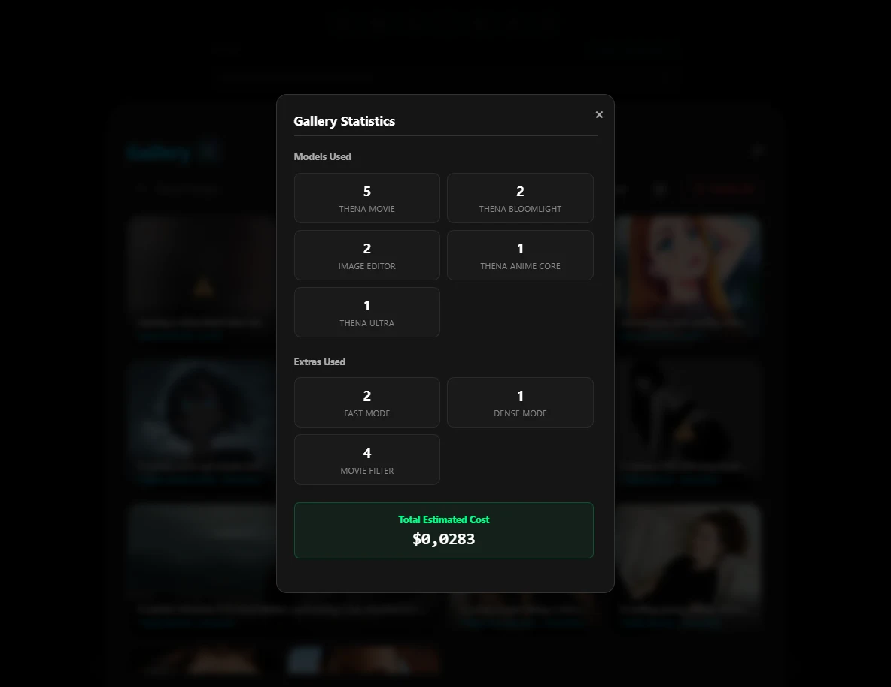
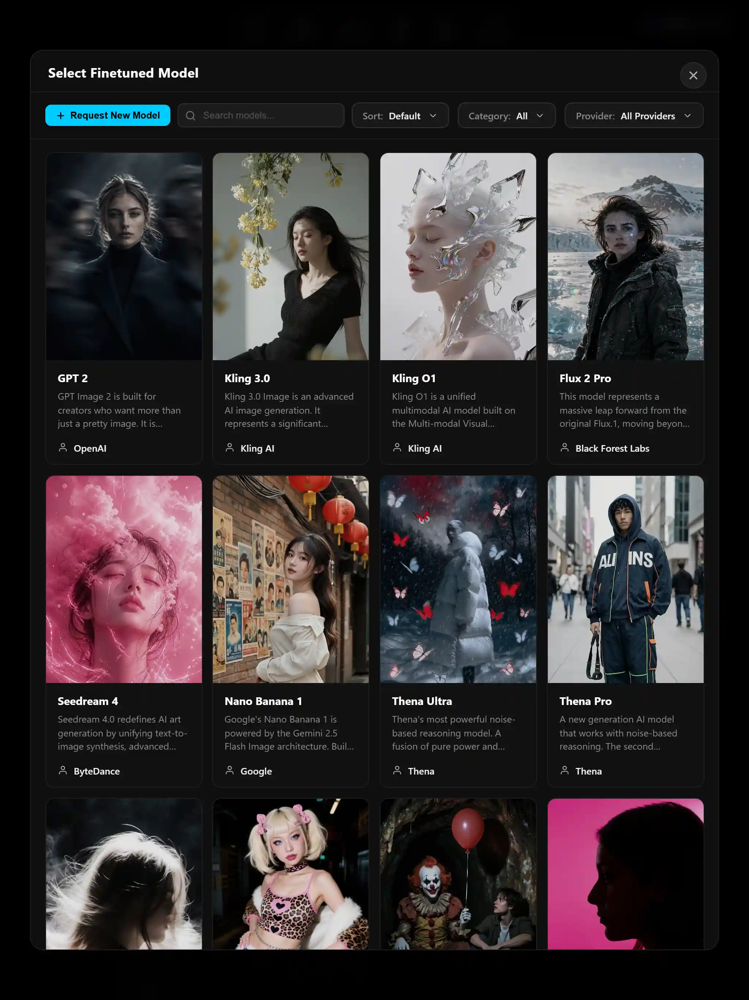

<div align="center">
  <b>🌍 <a href="README.md">English</a> &nbsp; | &nbsp; 🇹🇷 <a href="README.tr.md">Türkçe</a></b>
</div>

<br/>

<div align="center">

  <a href="https://phaticusthiccy.github.io/Thena-Web/">
    
  </a>

  <h1>THENA</h1>
  <h3>Yeni Nesil Yapay Zeka Görsel Üreticisi, Rol Yapma Sohbeti ve Yaratıcı Suite</h3>

  <p>
    <a href="https://github.com/phaticusthiccy/Thena-Web/issues">
      
    </a>
    <a href="https://github.com/phaticusthiccy/Thena-Web/stargazers">
      
    </a>
    <a href="https://github.com/phaticusthiccy/Thena-Web/blob/main/LICENSE">
      
    </a>
    
    
  </p>

  <blockquote>
    <em>Hayal gücünüzü saniyeler içinde çarpıcı görsellere dönüştürün — kurulum yok, backend yok, tamamen tarayıcınızda.</em>
  </blockquote>

  <a href="https://phaticusthiccy.github.io/Thena-Web/">
    
  </a>

  <br /><br />

</div>

---

## 🗂️ İçindekiler

- [Proje Hakkında](#-proje-hakkında)
- [Temel Özellikler](#-temel-özellikler)
- [Ekran Görüntüleri](#-ekran-görüntüleri)
- [Kurulum ve Kullanım](#%EF%B8%8F-kurulum-ve-kullanım)
- [Yapılandırma (API Anahtarı)](#-yapılandırma-api-anahtarı)
- [Teknoloji Yığını](#-teknoloji-yığını)
- [Katkıda Bulunma](#-katkıda-bulunma)
- [Lisans](#-lisans)

---

## 🚀 Proje Hakkında

**Thena**, tamamen **Vanilla JavaScript, HTML5 ve CSS3** ile inşa edilmiş, tarayıcı-yerel, yüksek performanslı bir Yapay Zeka yaratıcı platformudur — React yok, Vue yok, ağır framework yok. Modern tarayıcı API'lerinin (IndexedDB, Web Audio API, Canvas API, Service Workers) tüm gücünden yararlanarak, sekme içinden masaüstü kalitesinde bir deneyim sunar.

Üç güçlü sütunu tek bir kusursuz **Aşamalı Web Uygulamasında (PWA)** birleştirir:

| Sütun | Açıklama |
|---|---|
| 🎨 **Yapay Zeka Görsel Üretimi** | Canlı komut geri bildirimiyle çok modelli, çok stilli görsel sentezi |
| 🤖 **Yapay Zeka Rol Yapma Sohbeti** | Duygu farkındalıklı yapay zeka karakterleriyle derin anlatı sohbetleri |
| 🖼️ **Görüntü Düzenleyici** | Profesyonel düzeyde canvas araçları, filtreler, kırpma, yeniden boyutlandırma ve işaretleme |

---

## ✨ Temel Özellikler

### 🎨 Gelişmiş Görüntü Üretimi
- **Çoklu Model Desteği** — Benzersiz görsel stillere sahip Fotorealizm, Anime, Sinematik ve diğer yaratıcı modeller arasından seçim yapın.
- **Esnek En Boy Oranları** — Kare (1:1), Dikey (3:4, 9:16) ve Geniş Ekran (16:9, 4:3) formatları hazır olarak desteklenir.
- **Akıllı Üretim Parametreleri** — Hız için Hızlı Mod (Fast Mode), derinlik için Yaratıcı & Yoğun modlar ve keskin çıktılar için HighRes ölçekleme.
- **Genişletilmiş Şablonlar & Stiller** — Topluluk tarafından hazırlanmış komutları ve seçilmiş estetik stilleri tek tıklamayla anında uygulayın.
- **Canlı Komut Önizlemesi** — Üretim başlamadan önce gereken komut uzunluğunu ve karmaşıklığını gösteren dinamik görsel gösterge.
- **Sihirli Değnek ✨** — Kısa ve belirsiz komutları otomatik olarak zengin, ayrıntılı açıklamalara dönüştürür.

### 🤖 Yapay Zeka Rol Yapma Sohbeti
- **Sürükleyici Karakterler** — Tam anlamıyla işlenmiş lore ve arka plan hikayelerine sahip Yapay Zeka kişilikleriyle derin, hikaye odaklı sohbetlere dalın.
- **Üç Zeka Kademesi** — Anlatı ihtiyaçlarınıza göre Hızlı (Fast), Dengeli (Balanced) ve Ultra (Gelişmiş) yapay zeka modelleri arasında geçiş yapın.
- **Gerçek Zamanlı Duygu Motoru** — Canlı duygu analizi, karakterin yüz ifadesini hikayenin duygusal tonunu yansıtacak şekilde dinamik olarak günceller.
- **Kişiselleştirilmiş Kullanıcı Profilleri** — Kendi profilinizi oluşturun (İsim, Yaş, Cinsiyet). Karakterler, ton, hafıza ve yanıtlarını özellikle size göre uyarlar.
- **Esnek Kütüphane Düzenleri** — Karakter kadronuzu Izgara (Grid), Liste veya Kompakt görünümde düzenleyin — zahmetsizce geçiş yapın.
- **Anlatı Farkındalığı** — Yapay Zeka, `[FINISH]` sinyali aracılığıyla hikaye tamamlanmasını algılar ve yayları doğal sonuçlara yönlendirir.
- **The Warden — İçerik Denetimi** — Gerçek zamanlı yoğunluk göstergeleriyle (Düşük / Orta / Yüksek) entegre denetleme katmanı.

### 🖼️ Profesyonel Görüntü Düzenleyici
- **Anlık Filtre Şablonları** — Mükemmel görünümü bulmak için gerçek zamanlı yerelleştirilmiş arama çubuğuyla Instagram'dan ilham alınan filtreler uygulayın.
- **Manuel İnce Ayar** — Parlaklık, kontrast, doygunluk, sıcaklık ve daha fazlası üzerinde tam kontrol.
- **Kırpma ve Yeniden Boyutlandırma** — Oluşturulan sanatınızı her platform veya çözünürlük için hazırlayın — tamamı tarayıcı içinde.
- **İşaretleme Araçları** — Yaratıcı veya öğretici kullanım için oluşturulan görsellere çizim yapın, not ekleyin ve metin yerleştirin.
- **Çalışma Alanı Tercihleri** — Tercih ettiğiniz panel düzenini kaydedin ve iş akışınıza uyum sağlamak için editör görünümlerini değiştirin.

### 📊 Performans ve Optimizasyon
- **Gerçek Zamanlı Sistem İstatistikleri** — Canlı performans HUD'u aracılığıyla CPU yükünü, RAM kullanımını, FPS'i ve ortalama render sürelerini izleyin.
- **Akıllı Güç Tasarrufu** — Uygulama boştayken arka plan görevlerini otomatik duraklatır, sesi kapatır ve Wake Lock API'yi etkinleştirir.
- **Akıllı Render Motoru** — `IntersectionObserver` destekli animasyon duraklatma, ekran dışı öğeler için GPU/CPU yükünü önemli ölçüde azaltır.
- **Optimize Edilmiş Sohbet Render'ı** — DOM verimli mesaj hattı, binlerce mesajda bile pürüzsüz, takılmasız kaydırma sağlar.
- **Sürüklenebilir HUD** — Animasyonları bozmadan performans monitörünü ekranın herhangi bir yerine yeniden konumlandırın ve boyutlandırın.

### 🌐 Yerelleştirme ve Erişilebilirlik
- **Tam Çok Dilli Destek** — Dinamik arama mantığı, galeri etiketleri ve tüm sistem bildirimleri dahil olmak üzere **İngilizce** ve **Türkçe** dillerinde eksiksiz arayüz çevirisi.
- **Sesli Geri Bildirim Sistemi** — Etkileşimler için bağlamsal ses efektleri, özel Sessiz Mod geçişiyle.
- **Sinematik Giriş Deneyimi** — İlk açılışta sürükleyici bir fragman oynatılır; uygulamaya doğrudan atlamak için istediğiniz zaman atlayın.
- **Şık Mobil Deneyim** — Sürükle-kapat (drag-to-dismiss) alt sayfalar ve mobil için optimize edilmiş sohbet yan çubuklarıyla tam duyarlı düzen.

### 💾 Önce Yerel (Local-First) Mimarisi
- **Gelişmiş Galeri Yönetimi** — Uzun Basma (Long-Press) Çoklu Seçim moduyla görselleri filtreleyin, sıralayın (En Yeni / En Eski) ve toplu silin.
- **Sürükle-Kapat Hareketi** — Akıcı bir kaydırma hareketiyle tam ekran görüntü görünümlerini sezgisel olarak kapatın.
- **Sıfır-Backend Gizlilik** — Tüm medya, konuşmalar ve özel profiller yalnızca IndexedDB aracılığıyla tarayıcınızın yerel depolamasında yaşar.
- **Verileriniz Size Ait** — API anahtarları ve oluşturulan içerik asla cihazınızdan ayrılmaz. Gizli yükleme yok, hiçbir zaman.

---

## 📸 Ekran Görüntüleri

<div align="center">
  <table>
    <tr>
      <td align="center"><b>Ana Arayüz</b></td>
      <td align="center"><b>Gelişmiş Görüntü Düzenleyici</b></td>
    </tr>
    <tr>
      <td><a href="src/image_gen.webp"></a></td>
      <td><a href="src/image_edit.webp"></a></td>
    </tr>
  </table>
  <table>
    <tr>
      <td align="center"><b>Yapay Zeka Rol Yapma Sohbeti</b></td>
      <td align="center"><b>Galeri ve Filtreler</b></td>
    </tr>
    <tr>
      <td><a href="src/chatbot.webp"></a></td>
      <td><a href="src/gallery.webp"></a></td>
    </tr>
  </table>

  <br />

  <details>
    <summary><b>Daha Fazla Ekran Görüntüsü Göster</b></summary>
    <br />
    <table>
      <tr>
        <td align="center"><b>Sinematik Giriş</b></td>
        <td align="center"><b>Model Vitrini</b></td>
      </tr>
      <tr>
        <td><a href="src/trailer.webp"></a></td>
        <td><a href="src/showcase.webp"></a></td>
      </tr>
    </table>
    <table>
      <tr>
        <td align="center"><b>Sohbet — Açılış Sahnesi</b></td>
        <td align="center"><b>Sohbet — Hikaye Sonu</b></td>
      </tr>
      <tr>
        <td><a href="src/chat_start.webp"></a></td>
        <td><a href="src/chat_end.webp"></a></td>
      </tr>
    </table>
    <table>
      <tr>
        <td align="center"><b>Gelişmiş Ayarlar</b></td>
        <td align="center"><b>Uygulama Seçici</b></td>
      </tr>
      <tr>
        <td><a href="src/adv_settings_image_gen.webp"></a></td>
        <td><a href="src/apps.webp"></a></td>
      </tr>
    </table>
    <table>
      <tr>
        <td align="center"><b>Komut Önizleme Modülü</b></td>
        <td align="center"><b>Ayarlar Paneli</b></td>
      </tr>
      <tr>
        <td><a href="src/prompt_preview.webp"></a></td>
        <td><a href="src/settings.webp"></a></td>
      </tr>
    </table>
    <table>
      <tr>
        <td align="center"><b>Galeri İstatistikleri</b></td>
        <td align="center"><b>Yapay Zeka Model Tarayıcısı</b></td>
      </tr>
      <tr>
        <td><a href="src/gallery_stats.webp"></a></td>
        <td><a href="src/model_showcase.webp"></a></td>
      </tr>
    </table>
  </details>
</div>

---

## 🛠️ Kurulum ve Kullanım

Thena tamamen tarayıcı tarafındadır. **Sunucu kurulumu veya bağımlılık yüklemesi gerekmez.**

### Seçenek 1 — Doğrudan Açma
```bash
git clone https://github.com/phaticusthiccy/Thena-Web.git
```
Ardından tarayıcınızda açmak için `index.html` dosyasına çift tıklamanız yeterlidir.

### Seçenek 2 — Yerel Geliştirme Sunucusu *(Önerilen)*
Yerel sunucu çalıştırmak, CORS kısıtlamalarını önler ve tam PWA özelliklerini etkinleştirir (ses, çevrimdışı mod, yükleme isteği).

| Yöntem | Komut |
|---|---|
| **VS Code** | *Live Server* eklentisini yükleyin → **"Go Live"** düğmesine tıklayın |
| **Python** | `python -m http.server 8000` |
| **Node.js** | `npx http-server .` |

---

## 🔑 Yapılandırma (API Anahtarı)

Görüntü üretme özelliklerini kullanmak için bir API anahtarı gereklidir. Almak ücretsiz ve bir dakikadan az sürer.

1. Uygulama içindeki **"Get Your Free API Key"** bağlantısına tıklayın (resmi Telegram Bot'una yönlendirir).
2. Aldığınız anahtarı Ayarlar panelindeki `API Key` alanına yapıştırın.
3. Anahtarınız tarayıcınızın `LocalStorage` alanında güvenli şekilde saklanır — cihazınızdan asla ayrılmaz.

---

## 🧩 Teknoloji Yığını

| Teknoloji | Rol |
|---|---|
| **HTML5** | Semantik yapı, erişilebilirlik ve DOM düzeni |
| **CSS3** | Animasyonlar, Flexbox/Grid, Glassmorphism ve duyarlı tasarım |
| **JavaScript (ES6+)** | Temel uygulama mantığı, API iletişimi ve DOM yönetimi |
| **IndexedDB** | Görsel galeri ve sohbet geçmişi için kalıcı yerel depolama |
| **Web Audio API** | Gerçek zamanlı ses sentezi ve arayüz ses efektleri |
| **Canvas API** | Görüntü işleme, yeniden boyutlandırma, filtreleme ve düzenleme |
| **Service Workers** | PWA çevrimdışı yetenekleri ve yüklenebilirlik |

---

## 🤝 Katkıda Bulunma

Katkılar memnuniyetle karşılanır ve büyük takdirle değerlendirilir. Başlamak için:

1. **Fork** edin — Depoyu çatallayın.
2. **Branch oluşturun** — `git checkout -b feature/ozellik-adiniz`
3. **Commit edin** — `git commit -m 'feat: ozellik açıklamanızı ekleyin'`
4. **Push edin** — `git push origin feature/ozellik-adiniz`
5. **Pull Request açın** — Neyi değiştirdiğinizi açıklayın.

Lütfen geleneksel commit stilini takip edin ve PR'ları tek bir konuya odaklı tutun.

---

## 📝 Lisans

Bu proje [MIT](LICENSE) Lisansı kapsamında dağıtılmaktadır. Daha fazla bilgi için `LICENSE` dosyasına bakın.

<div align="center">
<br />
<p>Tutku ile geliştirildi: <a href="https://t.me/phaticusthiccy"><b>@phaticusthiccy</b></a></p>
<p><i>❤️ ve bol bol ☕ ile yapıldı.</i></p>
<br />
<a href="https://phaticusthiccy.github.io/Thena-Web/">
  
</a>
</div>
